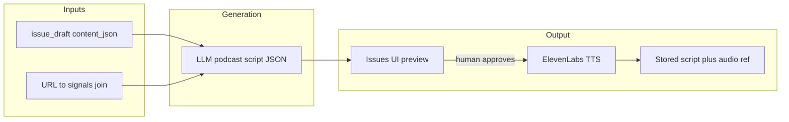

# Cornerstone OS
## System Specification v2.5

Owner: OnTheCorner Media  
Module: Newsroom Engine + LinkedIn Module  
Status: Active Development  
Supersedes: v2.4 (sections marked **[REVISED]** replace prior equivalents; sections marked **[NEW]** are additive)

---

# 1. Core Mission [REVISED]

Cornerstone OS exists to eliminate blank page friction and transform research into structured, voice-consistent, monetizable media assets — for any B2B thought leadership creator.

It must:

- Ingest research autonomously
- Extract structured editorial angles
- Generate viewpoint-driven drafts
- Enforce per-creator writing constraints
- Support modular section regeneration
- Persist structured draft objects
- Prepare publish-ready drafts across multiple output channels
- Support multiple creators via workspace-scoped configuration
- **Operate as a team of specialized agents, not a sequence of button clicks**

It is infrastructure, not a chatbot. It is a product, not a single-creator tool. It is a newsroom, not a prompt template.

---

# 2. Design Principles [REVISED]

1. Structured over freeform
2. Modular over monolithic
3. Deterministic over magical
4. Persist state, do not recompute everything
5. Human approval before publish
6. Voice guardrails enforced at system level
7. Replaceable LLM abstraction
8. Creator-configured, not system-hardcoded
9. API-connected over file import
10. Workspace-scoped by default
11. **Agents over endpoints** — each pipeline stage is an autonomous agent with tools, memory, and judgment — not a dumb prompt call
12. **Human gates, not human labor** — humans approve, they don't operate

---

# 3. System Architecture [REVISED]

## 3.0 Multi-Tenancy Model
_Unchanged from v2.0._

---

## 3.1 Agent Architecture [NEW]

### Overview

Cornerstone OS operates as a **newsroom staffed by specialized agents**. Each agent has a defined role, a set of tools it can invoke, memory of its previous runs, and the ability to make autonomous decisions within its scope.

```
┌──────────────┐     ┌──────────────┐     ┌──────────────┐     ┌──────────────┐
│  Researcher  │────▶│    Writer     │────▶│    Editor     │────▶│  Publisher   │
│              │     │              │     │              │     │              │
│  Ingests     │     │  Generates   │     │  Curates &   │     │  Exports &   │
│  signals     │     │  leads from  │     │  drafts from │     │  publishes   │
│  from feeds  │     │  signals     │     │  leads       │     │  content     │
│              │     │              │     │              │     │              │
│  Trigger:    │     │  Trigger:    │     │  Trigger:    │     │  Trigger:    │
│  scheduled   │     │  auto after  │     │  HUMAN GATE  │     │  HUMAN GATE  │
│  or manual   │     │  research    │     │  (approval)  │     │  (publish)   │
└──────────────┘     └──────────────┘     └──────────────┘     └──────────────┘
```

### Agent Definition

Each agent is defined by:

```typescript
type AgentDefinition = {
  id: string;                          // e.g. "researcher"
  name: string;                        // e.g. "Researcher Agent"
  role: AgentRole;                     // maps to LLM config
  systemPrompt: string;                // persistent identity and instructions
  tools: AgentTool[];                  // functions the agent can invoke
  triggerMode: "scheduled" | "event" | "manual";
  humanGate: boolean;                  // if true, agent stops and waits for human approval before next stage
};

type AgentTool = {
  name: string;                        // e.g. "query_signals"
  description: string;                 // what the tool does (provided to LLM)
  execute: (params: unknown) => Promise<unknown>;
};

type AgentRunState = {
  agent_id: string;
  workspace_id: string;
  run_id: string;
  started_at: string;
  status: "running" | "completed" | "failed" | "awaiting_human";
  context: Record<string, unknown>;    // what the agent learned this run
  decisions: string[];                 // what it decided and why
  output_summary: string;             // human-readable result
};
```

### Agents

#### Researcher Agent
- **Role:** Ingest fresh signals from RSS feeds and manual sources
- **LLM role:** `research`
- **Trigger:** Scheduled (daily) or manual
- **Human gate:** No
- **Tools:**
  - `check_signal_freshness` — query signals table to determine staleness per directive
  - `ingest_directive` — run RSS ingest for a specific directive
  - `ingest_all` — run all directives (daily + weekly based on schedule)
  - `report_summary` — log what was ingested, what's new vs. skipped
- **Decision-making:** Checks which directives have stale signals (>24h for daily, >7d for weekly) and only runs those. Reports what it found.

#### Writer Agent
- **Role:** Generate editorial leads from fresh signals
- **LLM role:** `leads`
- **Trigger:** Event (fires after Researcher completes, if new signals were ingested)
- **Human gate:** No (leads are generated as `pending_review`)
- **Tools:**
  - `query_fresh_signals` — get signals from the last 14 days grouped by directive
  - `check_existing_leads` — check for duplicate angles before generating
  - `generate_leads` — call LLM to produce leads from signals
  - `save_leads` — persist leads to DB with proper deduplication
- **Decision-making:** Skips directives that already have sufficient pending leads. Adjusts lead count based on signal volume.

#### Editor Agent
- **Role:** Editor-in-Chief. Reviews approved leads, makes all editorial decisions, and produces the newsletter draft.
- **LLM role:** `editor`
- **Trigger:** Event (fires after Writer Agent completes in the pipeline)
- **Human gate:** No — the Editor runs autonomously. The human gate is *after* the Editor, when the user reviews the finished draft before publishing.
- **Tools:**
  - `get_approved_leads` — fetch approved leads with angles, confidence scores
  - `evaluate_material` — analyze lead quality, theme diversity, and whether premium Insider Access content is warranted
  - `select_steering` — choose aggression, audience, focus, tone based on lead themes (with reasoning)
  - `generate_newsletter_draft` — run the full generation pipeline (thesis → angle → draft → lint) with chosen parameters
  - `update_draft_status` — mark draft status (draft/reviewed/published)
- **Decision-making:**
  - Refuses to draft if fewer than 3 approved leads
  - Autonomously selects steering parameters based on lead content (e.g., breach stories → high aggression, governance → analytical)
  - Decides output mode: `full_issue` always; `bundle` (with Insider Access) only when leads contain genuinely premium practitioner-grade content worth paying for
  - Insider Access is a paid offering — the Editor only produces it when the material warrants it
  - When Insider is produced in `bundle` mode, it is drafted **after** the public issue using the stored `content_json` (plus an allowlisted URL set), not by re-prompting raw leads alone

#### Draft Status Lifecycle

```
draft → reviewed → published
```
- `draft` — generated by Editor Agent
- `reviewed` — human has reviewed (optional)
- `published` — exported/pushed, this is the one that went out

Tracked via `status` column on `issue_drafts`:
```sql
ALTER TABLE issue_drafts ADD COLUMN status TEXT NOT NULL DEFAULT 'draft'
  CHECK (status IN ('draft', 'reviewed', 'published'));
```

#### Publisher Agent
- **Role:** Export and distribute finished drafts
- **LLM role:** None (no LLM needed — deterministic rendering)
- **Trigger:** Manual (human clicks publish)
- **Human gate:** Yes — human must review draft before publishing
- **Tools:**
  - `render_html` — convert draft to newsletter-ready HTML
  - `push_beehiiv` — create Beehiiv draft (feature-flagged)
  - `render_linkedin` — format for LinkedIn posting (Phase 2)

### Orchestrator

The **Pipeline Orchestrator** coordinates agent handoffs:

```
POST /api/pipeline/run
```

Accepts:
- `stages`: which agents to run (default: all non-gated)
- `triggered_by`: run provenance label (default: `manual`)

Workspace scope is taken from `WORKSPACE_ID` environment configuration.

Behavior:
1. Runs Researcher Agent — checks staleness, ingests stale directives
2. Runs Writer Agent — generates leads from fresh signals (skips if queue is full)
3. Runs Editor Agent — curates leads, selects steering, generates draft (refuses if <3 leads)
4. Human reviews the finished draft on the Issues page
5. Human triggers publish → runs Publisher Agent

The pipeline runs Researcher → Writer → Editor as a single autonomous sequence. The human gate is *after* the Editor, not before it.

Each agent run is logged to the `runs` table with agent metadata, enabling audit trail and trend analysis.

### Run State Persistence

```sql
-- Persisted via lib/agents/persistence.ts
INSERT INTO runs (
  workspace_id,
  run_type,
  status,
  input_refs_json,
  output_refs_json,
  finished_at
) VALUES (
  :workspace_id,
  'agent:' || :agent_id,
  :status,               -- initiated | completed | failed
  :input_refs_json,      -- includes agent_id, triggered_by, context
  :output_refs_json,     -- includes decisions, summary
  :finished_at
);
```

---

## 3.2 LLM Abstraction Layer [NEW]

### Overview

All LLM calls route through a unified provider abstraction. Each agent role can use a different provider and model, configured via environment variables.

**Implemented:** `lib/llm/provider.ts`

### Providers Supported
- **Anthropic** (Claude) — default
- **OpenAI** (GPT-4o, GPT-4o-mini, etc.)

### Configuration

```
# Global default
LLM_PROVIDER=anthropic
LLM_MODEL=claude-sonnet-4-20250514

# Per-role overrides (format: provider:model)
LLM_RESEARCH=openai:gpt-4o-mini
LLM_LEADS=anthropic:claude-sonnet-4-20250514
LLM_EDITOR=anthropic:claude-sonnet-4-20250514
LLM_DRAFTING=openai:gpt-4o
LLM_REVISION=anthropic:claude-sonnet-4-20250514
LLM_LINT=openai:gpt-4o-mini
LLM_LINKEDIN=anthropic:claude-sonnet-4-20250514
```

### API

```typescript
callLLM(role: AgentRole, messages: LLMMessage[], opts?: LLMRequestOptions): Promise<LLMResponse>
getModelForRole(role: AgentRole): { provider: LLMProvider; model: string }
```

---

## 3.3 Research Engine
_Unchanged from v2.0. Will be wrapped by Researcher Agent._

---

## 3.4 Leads Pipeline [REVISED]
_Unchanged from v2.0. Will be wrapped by Writer Agent. Added field: `channel` on `editorial_leads`._

---

## 3.5 Angle + Draft Engine
_Unchanged from v2.0. Will be wrapped by Editor Agent._

---

## 3.6 Revision Engine
_Unchanged from v2.0._

---

## 3.7 Publishing Engine [REVISED]
_Unchanged from v2.0. Will be wrapped by Publisher Agent._

---

## 3.8 LinkedIn Draft Engine
_Unchanged from v2.0._

---

## 3.9 Creator Onboarding + LinkedIn Connection
_Unchanged from v2.0._

---

## 3.10 Content Outlines (structure templates) **[NEW]** **[REVISED in v2.3]**

### Purpose

**Content outlines** define *what* the system assembles (section order, Fresh Signals shape, JSON output contract text, Insider Access section labels, etc.). They are **workspace-scoped** and **separate from brand profiles**.

**Brand profiles** define *who is speaking* (voice, character, constraints, emoji policy, narrative preferences). **Outlines** define *the artifact shape* the drafting agent must produce.

This separation allows multiple outlines per workspace (e.g. weekly newsletter vs. digest vs. premium follow-up) without duplicating voice configuration.

### Data model

Table: `content_outlines` (see `lib/supabase/schema-content-outlines.sql`).

| Column | Purpose |
|--------|---------|
| `workspace_id` | Scope |
| `name` | Human label in UI |
| `kind` | `newsletter_issue` \| `insider_access` |
| `spec_json` | Versioned outline spec (see below) |
| `is_default` | At most one default per `(workspace_id, kind)` |
| `disabled_at` | **Soft disable:** `timestamptz` nullable; `NULL` = active. “Delete” in the app sets this timestamp and clears `is_default`. There is **no re-enable** path in the UI for v1 (restore would be a manual SQL or future API). |

`issue_drafts` may store optional `content_outline_id` for traceability (see `lib/supabase/schema-issue_drafts.sql`; generation writes it when a DB-backed newsletter outline row is used).

**Schema:** apply `lib/supabase/schema-content-outlines.sql` in Supabase (idempotent); existing databases need at least `ALTER TABLE content_outlines ADD COLUMN IF NOT EXISTS disabled_at timestamptz;`.

### Spec JSON (v1)

**Newsletter (`kind: newsletter_issue`):**

```json
{
  "version": 1,
  "userPromptTemplate": "… placeholders {{PRIMARY_THESIS}}, {{STEERING_BLOCK}}, {{ANGLE_BLOCK}}, {{LEADS_BLOCK}}, {{PROMO_TEXT}} …",
  "systemPromptSuffix": "… appended after BRAND PROFILE JSON in the drafting system message …"
}
```

**Insider Access (`kind: insider_access`):**

```json
{
  "version": 1,
  "userPromptTemplate": "… {{PRIMARY_THESIS}}, {{STEERING_BLOCK}}, {{NEWSLETTER_SECTION}}, {{ALLOWED_URLS}}, {{LEADS_BLOCK}} …",
  "systemPromptTemplate": "… drafting system message …"
}
```

Built-in defaults live in code (`lib/content-outlines/default-specs.ts`). They are written to the database only through the app: `POST /api/content-outlines/seed` (Issues page: **Seed default outlines**) when a workspace has no outline rows yet. **Schema changes use SQL; outline row data is not maintained via checked-in seed SQL or one-off scripts.**

### REST API and UI **[REVISED]**

**List / create (collection)**

- `GET /api/content-outlines` — Returns `{ outlines }` (each row includes structured template fields derived from `spec_json`). By default only **active** rows (`disabled_at IS NULL`). Query `?includeDisabled=1` includes soft-disabled rows (e.g. Outlines admin list).
- `POST /api/content-outlines` — **Create.** Body uses **structured fields** only (no raw `spec_json` from the client): `name`, `kind`, `is_default`, `userPromptTemplate`, and either `systemPromptSuffix` (newsletter) or `insiderSystemPrompt` (Insider). Server validates, serializes to `spec_json`, returns `{ outline, warnings }`. `warnings` are non-blocking (e.g. missing `{{PLACEHOLDER}}` tokens).
- `POST /api/content-outlines/seed` — Insert default newsletter + Insider rows **if the workspace has no outline rows** (Issues page: **Seed default outlines**). Row data is app-only, not from checked-in SQL seed files.

**Single resource**

- `GET /api/content-outlines/[id]` — `{ outline }` (includes disabled rows for read-only visibility).
- `PATCH /api/content-outlines/[id]` — **Update** merged fields; **400** if row is disabled. If `is_default` is set true, other defaults for that `(workspace_id, kind)` are cleared first.
- `DELETE /api/content-outlines/[id]` — **Soft disable:** sets `disabled_at`, clears `is_default`; **400** if already disabled.

**Issue generation**

- `POST /api/issues/generate` accepts optional `contentOutlineId` (newsletter, when `outputMode` is `full_issue` or `bundle`), `insiderContentOutlineId` (when `bundle` or `insider_access`), and optional `sourceDraftId` when `outputMode` is `insider_access` to generate Insider from a saved issue’s `content_json`.
- When an outline **id is provided**, the server **asserts** the row exists, is **not** disabled, and **`kind`** matches; otherwise **400/404** — no silent fallback to the code default for a bad id.
- When **no** outline id is sent, resolution uses DB default or **code default** spec (same text as seeded defaults).

**UI**

- **`/outlines`** — Workspace-admin style page: list, create, edit (kind fixed after create), placeholder hints, save warnings, soft disable. Sidebar **Outlines** + **Manage outlines** link from Issues.
- **Issues** outline dropdowns load **`GET /api/content-outlines`** (active rows only).

### Insider Access vs. public issue **[REVISED]**

Insider Access remains a **separate artifact** from the public newsletter. **Bundle mode** generates the full issue first, then generates Insider using:

1. The **structured newsletter** (`content_json` subset as JSON text) as the primary editorial substrate.
2. The **allowed URL list** from the issue (and leads for grounding).
3. The **Insider outline** (`insider_access` kind) for section structure.

Standalone `insider_access` mode may still run from **approved leads only** (`newsletterPayloadJson` absent), or from **`sourceDraftId`** (load `content_json` from `issue_drafts`).

### Editor Agent tools (conceptual)

- `generate_newsletter_draft` loads **brand profile** + **resolved newsletter outline** (by id or workspace default or code fallback), then runs thesis → angle → draft → lint.
- Insider generation runs **after** the public `DraftObject` exists (bundle) or from a stored draft / leads as above.

---

## 3.11 Content products (Issues — Phase 2 panel) **[NEW in v2.4]**

### Purpose

**Content products** turn a persisted **newsletter draft** (`issue_drafts.content_json` / `DraftObject`) into derivative assets: social posts, podcast-oriented output, and sponsorship alignment copy. They are invoked from the **Issues** page (“Phase 2 — content products”) and use LLM generation over a **compact text summary** of the draft (see `lib/content-products/promptContext.ts`).

Workspace scope follows `WORKSPACE_ID`. Inputs are either `draftId` (server loads `content_json`) or an in-memory `content_json` override for the same shape.

### Social snippets

**Endpoint:** `POST /api/content-products/social-snippets`

**Request body:** `{ draftId?: string, content_json?: object }` — one of the two must supply the draft; `draftId` requires a saved row in `issue_drafts` for the workspace.

**Response (normative):** Structured JSON only — `{ ok: true, snippets: { x_post, linkedin_teaser, threads } }` (strings). The API does not change for presentation concerns.

**Product requirement — UI:** The Issues UI **must not** show this payload as a raw JSON blob. It **must** render **formatted** panels per network (X, LinkedIn, Threads): readable typography, optional character counts against the limits enforced in the prompt (e.g. X ~260 characters, Threads ~500), and **copy-to-clipboard** per field (and optionally a single “copy all” as plain text). A developer-only or secondary “raw JSON” view is optional.

**Voice:** Same Identity Jedi constraints as implemented in the route (direct, practitioner-respecting; no em dashes; avoid lazy contrast patterns).

### Podcast and ElevenLabs audio pipeline **[REVISED in v2.5]**

**Primary (Issues UI):** `POST /api/content-products/podcast-script` — loads the draft, resolves citation URLs to workspace **`signals`** (`lib/content-products/resolveSignals.ts`), builds a **Signal grounding** block plus `draftSummaryForContentProducts`, and returns `{ ok, script, grounding }` where `script` is TTS-oriented JSON: `working_title`, optional `estimated_runtime_minutes`, `script_segments[]` with `id`, optional `title`, **`narrator_text`** (spoken prose), optional `sources_acknowledged`, `outro_cta`. Request body may include **`podcastDelivery`** (`conversational` \| `deep_dive` \| `narrative`), **`podcastEnergy`** (`relaxed` \| `medium` \| `high`), and optional **`customDirection`** (short free-text). The first segment must use id **`intro`** (welcome + roadmap). Issues UI exposes these controls above **Podcast script**.

**Legacy:** `POST /api/content-products/podcast-outline` remains available (beats-style outline, no signal resolution); new work should use **podcast-script**.

**ElevenLabs:** `POST /api/content-products/podcast-tts` — request body `{ script: <PodcastScript> }` or `{ fullText: string }`, optional `voiceId` (defaults to `ELEVENLABS_VOICE_ID`). Server uses `ELEVENLABS_API_KEY`, optional `ELEVENLABS_MODEL_ID` (default `eleven_multilingual_v2`). Returns `audio/mpeg` (chunked synthesis + concatenated MP3). **Human gate:** Issues UI exposes download only on explicit click after script preview.

**Remaining (normative):**

1. **Persistence:** Table **`podcast_episodes`** (`lib/supabase/schema-podcast-episodes.sql`) + env **`PODCAST_AUDIO_STORAGE_BUCKET`**: `POST /api/content-products/podcast-tts` with `persist` + saved `draftId` inserts the row, uploads `{workspace_id}/{episode_id}.mp3`, sets `audio_ready`. In-memory drafts (no `draftId`) still download only.

2. **TTS safety:** Prompts require plain spoken prose; strip or forbid bracketed stage directions before TTS if authors introduce them later.



### Sponsorship alignment

**Endpoint:** `POST /api/content-products/sponsorship-alignment` — aligns draft context with revenue / sponsorship slots (experimental; same draft loading pattern as other content products).

---

# 4. Brand Profile Schema
_Unchanged from v2.0. Voice-only concerns; structural templates moved to §3.10._

---

# 5. Guardrails
_Unchanged from v2.0._

---

# 6. MVP Definition [REVISED]

Cornerstone OS must:

1. Support workspace-scoped multi-tenancy (existing)
2. Pull research via RSS directives — autonomously via Researcher Agent
3. Produce editorial-ready leads — autonomously via Writer Agent after research
4. Generate newsletter drafts from approved leads via Editor Agent with curation intelligence
5. Generate LinkedIn drafts from approved leads or newsletter sections
6. Apply per-creator voice guardrails to all generated content
7. Allow regeneration of individual sections — newsletter and LinkedIn
8. Persist structured drafts — `DraftObject` for newsletter, `LinkedInDraftObject` for LinkedIn
9. Support creator onboarding via API-connected flow
10. Export publish-ready content for both channels via Publisher Agent
11. **Operate Research → Leads as an autonomous pipeline with human gate at lead approval**
12. **Support pluggable LLM providers per agent role**

Stretch:
13. LinkedIn Marketing API analytics pull
14. Direct LinkedIn post publishing via API
15. Scheduled pipeline automation (Vercel cron → Pipeline Orchestrator)

---

# 7. Implementation Status [REVISED]

| Component | Status | Notes |
|-----------|--------|-------|
| Research Engine | Implemented | Used by Researcher Agent tools for staleness checks + RSS ingest |
| Leads pipeline | Implemented | Lifecycle: pending → approved → drafted → dismissed; 14-day window; dedup |
| Thesis + Angle + Draft | Implemented | Editor Agent curation, editorial angle with title uniqueness |
| Draft persistence | Implemented | `content_json` with `DraftObject` + runtime validation |
| Deterministic renderer | Implemented | `renderDraftMarkdown()` + `renderDraftHtml()` |
| Guardrails — system level | Implemented | Lint + auto-rewrite; em/en dash, forbidden phrases, editorial bias |
| Guardrails — creator level | Not started | Requires brand profile refactor |
| Guardrails — LinkedIn patterns | Not started | New |
| Revision Engine | Implemented | Section-level regen with lint retries |
| Publishing — HTML + Beehiiv | Implemented | HTML export always on; Beehiiv feature-flagged |
| Publishing — LinkedIn export | Not started | New |
| **LLM Abstraction Layer** | **Implemented** | Anthropic + OpenAI; per-role config via env vars |
| **Agent Framework** | **Partial** | `lib/agents/framework.ts` — tool loop, agent definitions, role-routed LLM calls; Phase 1 productization (dashboard, autonomy, structured errors) ongoing |
| **Researcher Agent** | **Partial** | `lib/agents/researcher.ts` — freshness + ingest tools over existing research APIs; extend as needed for scheduled autonomy |
| **Writer Agent** | **Partial** | `lib/agents/writer.ts` — signal query + lead generation tools; extend as needed |
| **Editor Agent** | **Implemented** | Issue path: curation + `POST /api/issues/generate` (lead evaluation, steering, output mode, draft generation); `lib/agents/editor.ts` for pipeline orchestration |
| **Content outlines** | **Implemented** | `content_outlines` with `disabled_at`; REST `/api/content-outlines` + `/api/content-outlines/[id]`; `/outlines` CRUD UI; seed route; generate validates outline ids |
| **Draft status lifecycle** | **Implemented** | draft → reviewed → published tracking on `issue_drafts` |
| **Publisher Agent** | **Not started** | Wraps publish endpoints |
| **Pipeline Orchestrator** | **Partial** | `POST /api/pipeline/run` — staged `researcher` → `writer` → `editor`, optional `stages`; manual from Research UI; no scheduled/cron runner yet |
| **Agent run state** | **Implemented** | Persisted to **`runs`** (`run_type` like `agent:…`); dedicated **`agent_runs`** table not used (Phase 1 doc originally assumed otherwise) |
| Brand profile — generic schema | Not started | Replaces hardcoded seed |
| Creator onboarding flow | Not started | New |
| LinkedIn OAuth connection | Not started | New |
| Post analysis + content type derivation | Not started | New |
| LinkedIn Draft Engine | Not started | New |
| LinkedIn Revision Engine | Not started | New |
| linkedin_drafts table | Not started | New |
| linkedin_connections table | Not started | New |
| Manual topic injection | Implemented | `/api/signals/create` + UI |
| Draft history | Implemented | `/api/issues/list` + UI with compare view |
| QoL — signals freshness | Implemented | Freshness indicator + stale warning |
| QoL — bulk lead actions | Implemented | Approve All / Dismiss All |
| QoL — draft comparison | Implemented | Side-by-side compare view |
| Test suite | Implemented | 171+ tests |
| UI | Implemented | Dark theme, sidebar nav, full feature access |
| **Content products — Social snippets API** | **Implemented** | `POST /api/content-products/social-snippets`; returns structured `snippets` JSON |
| **Content products — Social snippets UI** | **Implemented** | Issues Phase 2: formatted X / LinkedIn / Threads panels, counts, copy, optional raw JSON — §3.11 |
| **Content products — Podcast outline API** | **Implemented** | `POST /api/content-products/podcast-outline` (legacy beats outline) |
| **Content products — Podcast script + signal grounding** | **Implemented** | `POST /api/content-products/podcast-script`; URL → `signals` resolution; TTS-ready segments |
| **Content products — ElevenLabs TTS** | **Partial** | `POST /api/content-products/podcast-tts`; download + optional persist to `podcast_episodes` + Storage when `PODCAST_AUDIO_STORAGE_BUCKET` + saved `draftId` — §3.11 |
| **Content products — Sponsorship alignment** | **Implemented** | `POST /api/content-products/sponsorship-alignment` (experimental) |

**Note (spec vs code, v2.3):** Phase 1 roadmap language originally assumed a greenfield `agent_runs` table. The current codebase **reuses `runs`** for agent persistence and exposes **`/api/pipeline/run`** for development-style orchestration. Remaining Phase 1 work includes a **pipeline status dashboard**, **scheduled automation**, and tighter **human-gated** autonomy — see §8.

**Note (v2.4–v2.5):** Phase 2 **content products** are specified in §3.11. **v2.5** lands formatted Social UI, **podcast-script** + signal grounding, and **podcast-tts** (download). Persisted script/audio artifacts remain roadmap (§8 Phase 2B).

---

# 8. Roadmap [REVISED]

## Phase 1 — Agent Framework + Autonomous Pipeline
- **Landed:** agent abstraction (`lib/agents/framework.ts`) — definition, tool registry, run loop, role-routed LLM calls
- **Landed:** Researcher Agent — `check_signal_freshness`, `ingest_directive`, `report_summary` (`lib/agents/researcher.ts`)
- **Landed:** Writer Agent — `query_fresh_signals`, `check_existing_leads`, `generate_leads_for_directive` (`lib/agents/writer.ts`)
- **Landed:** Pipeline Orchestrator — `POST /api/pipeline/run` (staged researcher → writer → editor)
- **Landed:** agent run persistence via **`runs`** (`run_type` prefix `agent:`)
- **Hardening:** structured errors, clearer stage contracts, optional abort / human gate between stages; formalize `runs` contract in UI filters or migrate to **`agent_runs`** if queries outgrow `runs`
- **Autonomy:** Research → Leads should run on a schedule or events; **human gate at lead approval** remains non-negotiable
- **Remaining:** **pipeline status dashboard** (agent run history, failures, last trigger) — beyond the Research console “run pipeline” control

## Phase 2 — Brand Profile, LinkedIn Foundation, and Content Products

### Phase 2A — Brand profile refactor + LinkedIn foundation
- Deprecate `POST /api/brand-profiles/seed`
- Implement generic `CreatorBrandProfile` schema
- Build creator onboarding flow (Steps 1–5)
- Implement LinkedIn OAuth connection
- Add `channel` field to `editorial_leads`
- Add `linkedin_connections` and `linkedin_drafts` tables
- Add LinkedIn-specific lint patterns
- Migrate existing workspace through onboarding flow

### Phase 2B — Content products (Issues)
- **Landed:** Social snippets formatted UI; **podcast-script** + signal URL resolution; **podcast-tts** ElevenLabs MP3 download (human-gated); see §3.11.
- **Remaining:** Persist script JSON + audio references to DB/storage; optional deprecate **podcast-outline** once unused; workspace-scoped voice defaults in brand profile.

## Phase 3 — LinkedIn Draft Engine
- Build LinkedIn generate / regenerate / list / publish endpoints
- Add LinkedIn tab to Issues page
- Add channel selector to Leads approval UI
- LinkedIn draft management UI
- Expand test suite

## Phase 4 — Direct Publishing + Analytics
- LinkedIn post publishing via API
- LinkedIn Marketing API analytics pull
- Feedback loop: performance data updates benchmarks
- Scheduled pipeline automation (Vercel cron → Pipeline Orchestrator)

## Phase 5 — Multi-Brand + Platform Expansion
- Multi-brand orchestration
- Revenue alignment scoring
- Semi-autonomous issue drafting with confidence scoring
- Additional output channels (Twitter/X, Substack Notes)

---

# 9. Migration Notes
_Unchanged from v2.0._

---

End of Specification v2.5
